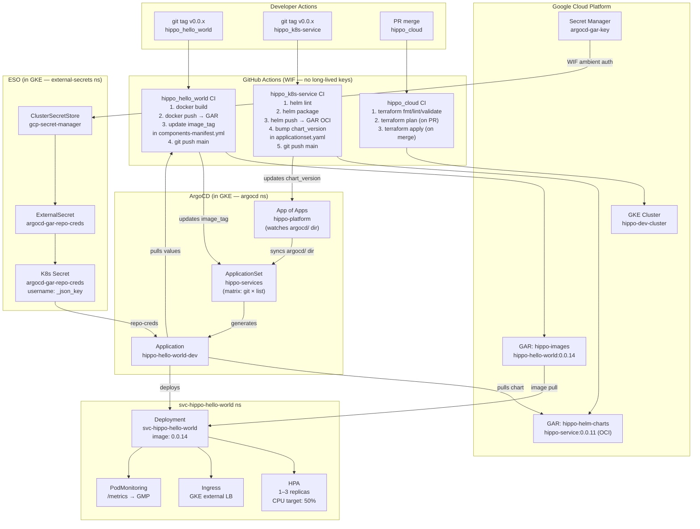
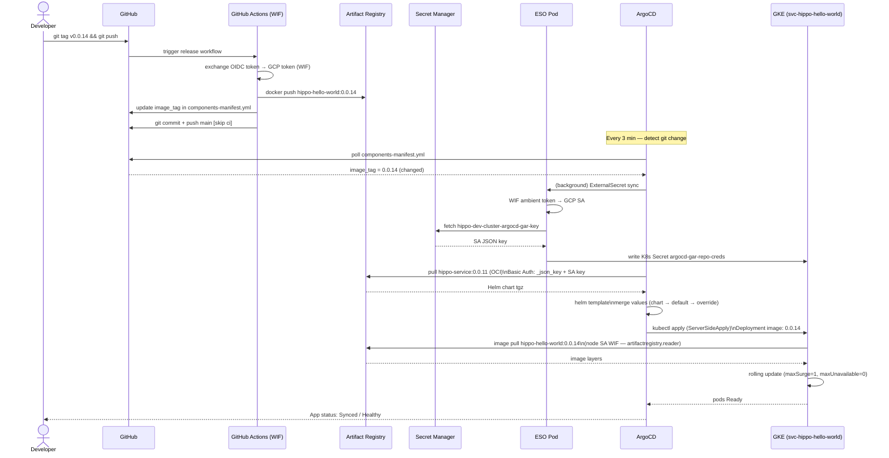
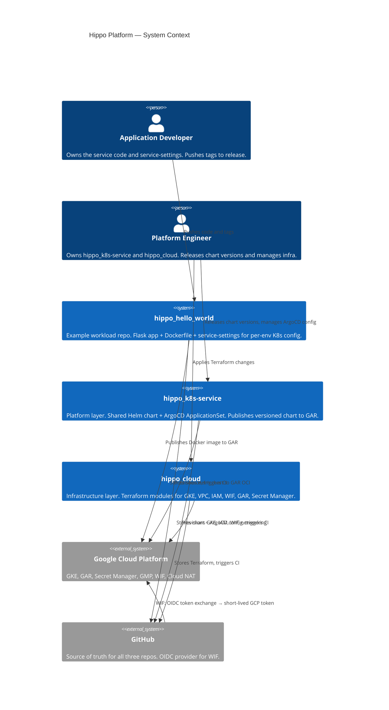
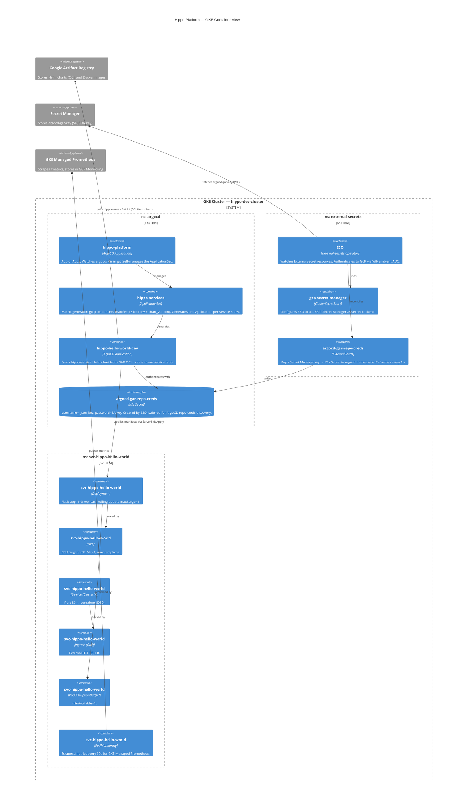
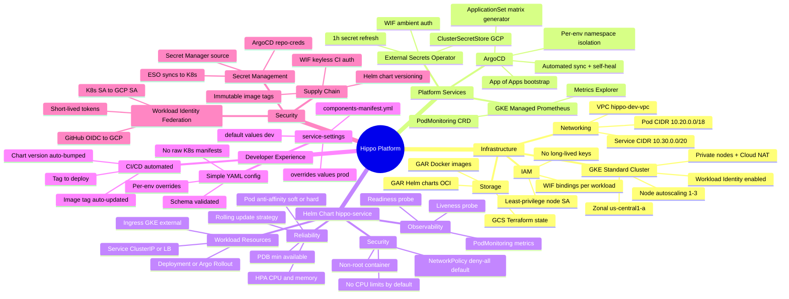
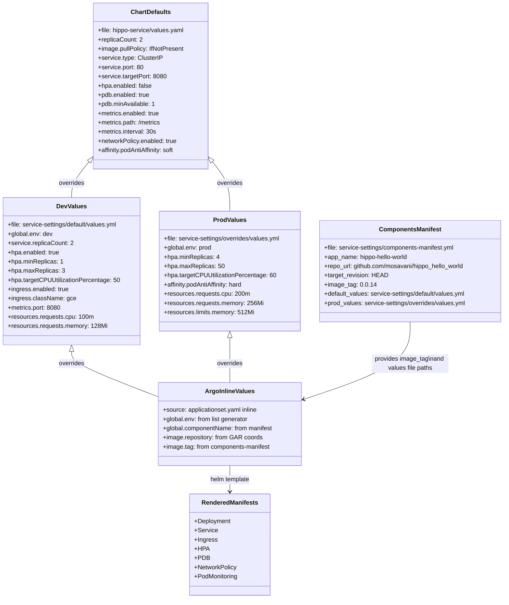

# Hippo Platform — Architecture

## Overview

The Hippo platform is a GitOps-based, three-layer system for deploying Kubernetes services on GKE. It separates concerns across three repositories so infrastructure, platform, and application teams can move independently.

| Layer | Repo | Owns | Changed by |
|---|---|---|---|
| **1 — Cloud** | `hippo_cloud` | GKE, VPC, IAM, WIF, GAR, Secret Manager | Platform/Infra team via Terraform |
| **2 — Platform** | `hippo_k8s-service` | Helm chart, ArgoCD, CI/CD standard, monitoring | Platform team via chart release tags |
| **3 — Workload** | `hippo_hello_world` | App code, Dockerfile, service-settings | Dev team — only touches `service-settings/` for K8s config |

---

## Diagrams

- [1. Flowchart — CI/CD & Deployment Flows](#1-flowchart--cicd--deployment-flows)
- [2. Sequence — App Release End-to-End](#2-sequence--app-release-end-to-end)
- [3. C4 — System Context](#3-c4--system-context)
- [4. C4 — Container (GKE internals)](#4-c4--container-gke-internals)
- [5. Mindmap — Platform Capabilities](#5-mindmap--platform-capabilities)
- [6. Class — Values Hierarchy](#6-class--values-hierarchy)

---

## 1. Flowchart — CI/CD & Deployment Flows



---

## 2. Sequence — App Release End-to-End



---

## 3. C4 — System Context



---

## 4. C4 — Container (GKE Internals)



---

## 5. Mindmap — Platform Capabilities



---

## 6. Class — Values Hierarchy & Chart Structure



---

## Component Inventory

### hippo_cloud — Terraform Modules

| Module | Resources |
|---|---|
| `modules/networking` | VPC, subnet, secondary CIDRs (pods/services), Cloud Router, Cloud NAT |
| `modules/gke` | `google_container_cluster`, node pool, WI, shielded nodes, private cluster |
| `modules/iam` | Node SA, least-privilege roles, `artifactregistry.reader` |
| `modules/workload-identity` | GCP SAs, K8s↔GCP WIF bindings, GitHub Actions OIDC bindings |

### hippo_k8s-service — Helm Chart Templates

| Template | Conditional |
|---|---|
| `deployment.yaml` | Suppressed when `rollout.enabled=true` |
| `rollout.yaml` | Only when `rollout.enabled=true` |
| `service.yaml` | Always |
| `ingress.yaml` | `ingress.enabled=true` |
| `hpa.yaml` | `hpa.enabled=true` |
| `pdb.yaml` | `pdb.enabled=true` |
| `netpolicies.yaml` | `networkPolicy.enabled=true` |
| `podmonitoring.yaml` | `metrics.enabled=true` |

### Auth — WIF Service Accounts

| Identity | Type | Roles | Used by |
|---|---|---|---|
| `hippo-dev-cluster-nodes` | GCP SA (node pool) | `logging.logWriter`, `monitoring.metricWriter`, `artifactregistry.reader` | GKE nodes (image pull) |
| `hippo-dev-cluster-eso` | GCP SA (WIF K8s) | `secretmanager.secretAccessor` | ESO pod → Secret Manager |
| `hippo-dev-cluster-argocd-repo` | GCP SA (WIF K8s) | `artifactregistry.reader` | argocd-repo-server (legacy) |
| `hippo-helm-publisher` | GCP SA (WIF GitHub) | `artifactregistry.writer` | CI: helm push (per-repo binding) |
| `hippo-image-publisher` | GCP SA (WIF GitHub) | `artifactregistry.writer` | CI: docker push (per-org binding) |

---

## Key Design Decisions

**1. Three-repo separation**
Infrastructure, platform config, and application code evolve at different rates and are owned by different teams. Keeping them separate avoids coupling and allows independent release cycles.

**2. ArgoCD v3 OCI repoURL**
ArgoCD v3 uses `repoURL` verbatim as the OCI v2 API path — it does NOT append the `chart` field. The chart artifact name (`/hippo-service`) must be included in `repoURL`:
```
oci://us-central1-docker.pkg.dev/<project>/<repo>/hippo-service
```

**3. App of Apps pattern**
`hippo-platform` (Application) watches the `argocd/` directory and self-manages the ApplicationSet. Any push to `argocd/` on main is automatically applied — no manual `kubectl apply` needed after initial bootstrap.

**4. ESO + Secret Manager over WIF direct for ArgoCD**
ArgoCD's repo-server does not natively support GKE WIF ambient credentials for OCI GAR auth. ESO bridges this: it reads the SA JSON key from Secret Manager (using WIF) and writes it as a K8s Secret that ArgoCD can use with standard `_json_key` Basic Auth.

**5. Federated service-settings**
Each service repo owns its `service-settings/` directory. ArgoCD's ApplicationSet git generator reads `components-manifest.yml` directly from the service repo — no central registration file needed beyond adding the repo URL to the ApplicationSet.

**6. chart_version auto-bump**
The release workflow in `hippo_k8s-service` stamps the chart version into `applicationset.yaml` and commits back to main. This means releasing a new chart version automatically rolls it out to all managed services on the next ArgoCD sync — no manual edits required.
