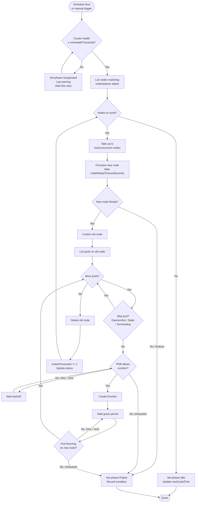
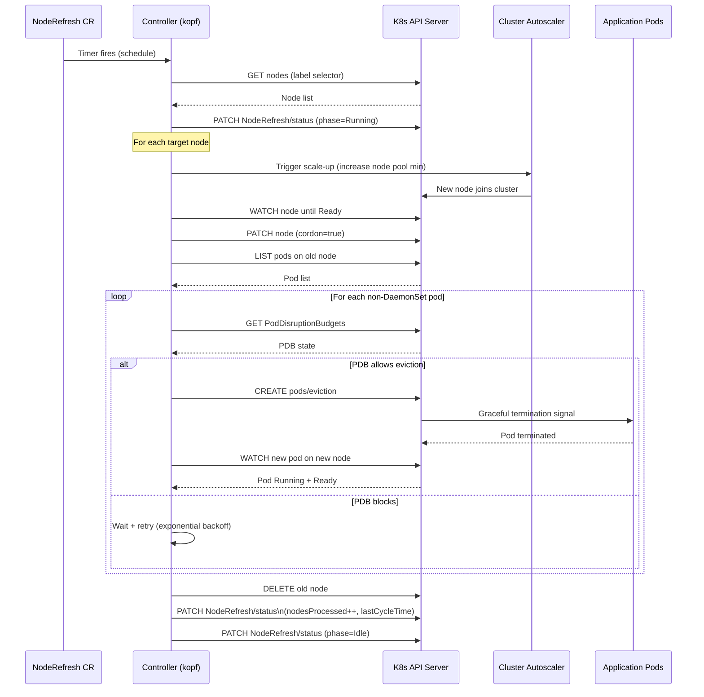
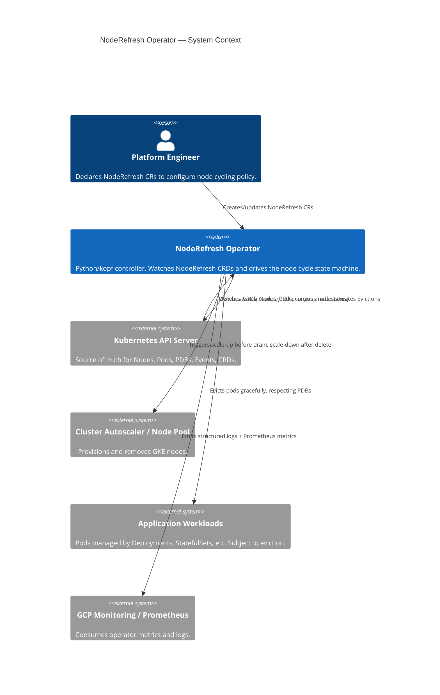
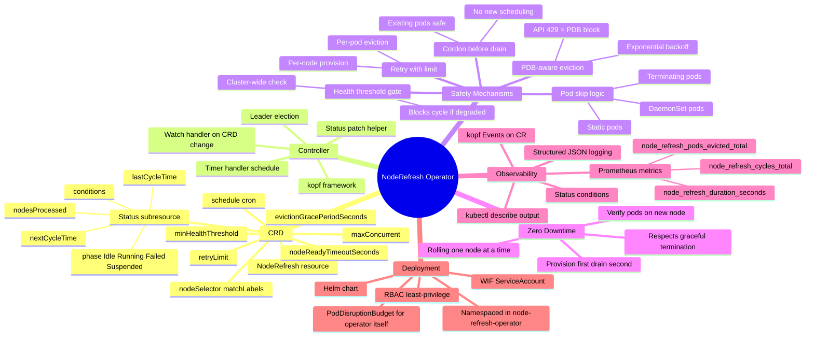

# Project 2: Kubernetes Operator for Zero-Downtime Node Cycling

> **Design document only — no implementation changes.**

---

## Table of Contents

- [Overview](#overview)
- [Architecture](#architecture)
- [CRD Design](#crd-design)
- [Controller Design](#controller-design)
- [Reconciliation Loop](#reconciliation-loop)
- [Core Algorithms](#core-algorithms)
- [Diagrams](#diagrams)
- [File Structure](#file-structure)
- [Key Design Decisions](#key-design-decisions)
- [Failure Modes & Mitigations](#failure-modes--mitigations)

---

## Overview

A Python-based Kubernetes Operator that safely rotates GKE nodes every N days with zero
downtime. The operator introduces a `NodeRefresh` Custom Resource Definition (CRD) that
lets platform teams declare *how* nodes should be cycled — target selection, concurrency
limits, health thresholds — and the controller enforces it continuously.

**Why an operator?**
Node cycling is a stateful, multi-step process (provision → cordon → drain → verify →
uncordon/delete) that must respect PodDisruptionBudgets, readiness probes, and retry
semantics. An operator embeds this logic in-cluster so it runs automatically without
human intervention or external cron jobs.

---

## Architecture

```
┌──────────────────────────────────────────────────────────────────┐
│  Kubernetes API Server                                           │
│                                                                  │
│  NodeRefresh CRD  ──watch──►  NodeRefresh Controller (Python)   │
│  Node objects     ──watch──►  (kopf framework)                  │
│  Pod objects      ──watch──►                                     │
└──────────────────────────────────────────────────────────────────┘
                                        │
                         ┌──────────────┼──────────────┐
                         ▼              ▼              ▼
                   Cordon node    Evict pods      Verify health
                   (K8s API)      (Eviction API)  (Pod readiness)
                                                       │
                                                       ▼
                                               Delete old node
                                               (GKE node pool
                                                scale-down)
```

**Components:**

| Component | Technology | Purpose |
|---|---|---|
| CRD | `apiextensions.k8s.io/v1` | Declares `NodeRefresh` resource schema |
| Controller | Python + `kopf` | Watches CRDs and Nodes, drives reconciliation |
| RBAC | ClusterRole + ClusterRoleBinding | Grants controller least-privilege access |
| ServiceAccount | WIF-annotated | No long-lived credentials |
| Helm chart | `node-refresh-operator/` | Packages and deploys the operator |

---

## CRD Design

### NodeRefresh Custom Resource

```yaml
apiVersion: hippo.io/v1alpha1
kind: NodeRefresh
metadata:
  name: default-node-refresh
  namespace: node-refresh-operator
spec:
  # Label selector — which nodes to target.
  # Matches GKE node pool labels, e.g. cloud.google.com/gke-nodepool: default-pool
  nodeSelector:
    matchLabels:
      cloud.google.com/gke-nodepool: default-pool

  # Max nodes to cycle concurrently. Set to 1 for safest operation.
  maxConcurrent: 1

  # Percentage of pods across ALL targeted nodes that must be Ready
  # before the controller proceeds with any eviction. 0–100.
  minHealthThreshold: 80

  # How often to run the refresh cycle (cron syntax).
  # Omit or set to "" to disable scheduled cycling (manual trigger only).
  schedule: "0 2 */3 * *"   # 02:00 UTC every 3 days

  # Seconds to wait after a pod is evicted before checking readiness
  # on the new node. Gives time for the scheduler to place and start pods.
  evictionGracePeriodSeconds: 60

  # Max attempts to evict a single pod before marking it as failed.
  retryLimit: 3

  # Max seconds to wait for a node to become Ready after provisioning.
  nodeReadyTimeoutSeconds: 300

status:
  # Controller-managed — do not set manually.
  phase: Idle          # Idle | Running | Failed | Suspended
  lastCycleTime: ""    # RFC3339 timestamp of last completed cycle
  nextCycleTime: ""    # RFC3339 timestamp of next scheduled cycle
  currentNode: ""      # Node currently being drained (if Running)
  nodesProcessed: 0    # Total nodes cycled since creation
  conditions:
    - type: CycleComplete
      status: "True"
      lastTransitionTime: ""
      reason: AllNodesRefreshed
      message: "3 nodes cycled successfully"
    - type: Degraded
      status: "False"
      lastTransitionTime: ""
      reason: ""
      message: ""
```

### CRD Schema (abbreviated)

```yaml
apiVersion: apiextensions.k8s.io/v1
kind: CustomResourceDefinition
metadata:
  name: noderefreshes.hippo.io
spec:
  group: hippo.io
  names:
    kind: NodeRefresh
    plural: noderefreshes
    singular: noderefresh
    shortNames: [nr]
  scope: Namespaced
  versions:
    - name: v1alpha1
      served: true
      storage: true
      subresources:
        status: {}          # Enables /status subresource (controller writes separately)
      additionalPrinterColumns:
        - name: Phase
          jsonPath: .status.phase
          type: string
        - name: Last-Cycle
          jsonPath: .status.lastCycleTime
          type: date
        - name: Next-Cycle
          jsonPath: .status.nextCycleTime
          type: date
        - name: Nodes-Processed
          jsonPath: .status.nodesProcessed
          type: integer
      schema:
        openAPIV3Schema:
          type: object
          required: [spec]
          properties:
            spec:
              type: object
              required: [nodeSelector, maxConcurrent, minHealthThreshold]
              properties:
                nodeSelector:
                  type: object
                  required: [matchLabels]
                  properties:
                    matchLabels:
                      type: object
                      additionalProperties:
                        type: string
                maxConcurrent:
                  type: integer
                  minimum: 1
                  maximum: 5
                minHealthThreshold:
                  type: integer
                  minimum: 0
                  maximum: 100
                schedule:
                  type: string
                evictionGracePeriodSeconds:
                  type: integer
                  minimum: 0
                  default: 60
                retryLimit:
                  type: integer
                  minimum: 1
                  maximum: 10
                  default: 3
                nodeReadyTimeoutSeconds:
                  type: integer
                  minimum: 60
                  maximum: 1800
                  default: 300
            status:
              type: object
              x-kubernetes-preserve-unknown-fields: true
```

---

## Controller Design

### Framework: `kopf`

[kopf](https://kopf.readthedocs.io) (Kubernetes Operator Pythonic Framework) is chosen over
raw `kubernetes` client loops because it provides:
- Declarative `@kopf.on.*` event handlers
- Automatic retry with backoff
- Status patching helpers
- Leader election (safe multi-replica deployment)
- Timer handlers for scheduled reconciliation

### RBAC (least-privilege)

```yaml
# ClusterRole — only what the controller needs
rules:
  # Read NodeRefresh CRDs
  - apiGroups: [hippo.io]
    resources: [noderefreshes]
    verbs: [get, list, watch]
  # Write NodeRefresh status only (via /status subresource)
  - apiGroups: [hippo.io]
    resources: [noderefreshes/status]
    verbs: [patch, update]
  # Read and cordon nodes
  - apiGroups: [""]
    resources: [nodes]
    verbs: [get, list, watch, patch]
  # Read pods, create evictions
  - apiGroups: [""]
    resources: [pods]
    verbs: [get, list, watch]
  - apiGroups: [""]
    resources: [pods/eviction]
    verbs: [create]
  # Read PodDisruptionBudgets (to respect them)
  - apiGroups: [policy]
    resources: [poddisruptionbudgets]
    verbs: [get, list, watch]
  # Events (for kubectl describe output)
  - apiGroups: [""]
    resources: [events]
    verbs: [create, patch]
```

---

## Reconciliation Loop

### State Machine

```
          ┌─────────┐
          │  Idle   │◄──────────────────────────────────┐
          └────┬────┘                                   │
               │ schedule fires OR manual trigger        │
               ▼                                        │
          ┌─────────────────┐                           │
          │ Health Check    │──── below threshold ──►  Suspended
          │ (cluster-wide)  │                           │
          └────┬────────────┘                           │
               │ above threshold                        │
               ▼                                        │
          ┌─────────────────┐                           │
          │ Select Nodes    │                           │
          │ (label match)   │                           │
          └────┬────────────┘                           │
               │                                        │
               ▼   ┌───────────────────────────────┐   │
          ┌─────────┤  For each node (maxConcurrent)│   │
          │ Running │                               │   │
          └────┬────┘  1. Provision new node        │   │
               │       2. Cordon old node           │   │
               │       3. Evict pods (respect PDB)  │   │
               │       4. Verify pods on new node   │   │
               │       5. Delete old node           │   │
               │                                    │   │
               │       Retry on failure (retryLimit)│   │
               └───────────────────────────────────┘   │
               │                                        │
               ▼                                        │
          ┌─────────┐                                   │
          │Complete │───────────────────────────────────┘
          └─────────┘   update lastCycleTime, nodesProcessed
```

### Per-Node Cycle Steps

```
Step 1: PROVISION
  - Trigger GKE node pool scale-up (or rely on cluster autoscaler)
  - Wait for new node Ready (nodeReadyTimeoutSeconds)
  - Verify new node passes health checks

Step 2: CORDON
  - kubectl cordon <old-node>
  - No new pods will be scheduled to old node
  - Existing pods unaffected

Step 3: DRAIN (pod-by-pod eviction)
  For each pod on old node:
    a. Skip: DaemonSet pods (will reschedule automatically)
    b. Skip: pods with ownerRef=Node (static pods)
    c. Check PDB: if eviction would violate PDB → wait + retry
    d. Create Eviction object (respects graceful termination)
    e. Wait evictionGracePeriodSeconds
    f. Verify pod is Running on a different node
    g. On failure: retry up to retryLimit, then mark NodeRefresh as Failed

Step 4: VERIFY
  - Wait for all evicted pods to be Running + Ready on new node
  - Re-check cluster-wide minHealthThreshold
  - If below threshold: pause, wait, retry

Step 5: DELETE
  - Remove old node from cluster
  - Update status.nodesProcessed += 1
  - Proceed to next node (up to maxConcurrent)
```

---

## Core Algorithms

### Health Check

```python
def cluster_health_ok(v1, spec) -> bool:
    """
    Returns True if the percentage of Ready pods across ALL nodes
    targeted by this NodeRefresh meets the minHealthThreshold.
    """
    threshold = spec["minHealthThreshold"]
    selector = spec["nodeSelector"]["matchLabels"]

    # Get all pods on targeted nodes
    nodes = v1.list_node(label_selector=to_label_selector(selector))
    node_names = {n.metadata.name for n in nodes.items}

    pods = v1.list_pod_for_all_namespaces(
        field_selector=f"spec.nodeName in ({','.join(node_names)})"
    )

    total = len(pods.items)
    if total == 0:
        return True  # No pods → trivially healthy

    ready = sum(
        1 for pod in pods.items
        if all(
            c.status for c in (pod.status.conditions or [])
            if c.type == "Ready"
        )
    )
    health_pct = (ready / total) * 100
    logger.info(f"Cluster health: {ready}/{total} pods Ready ({health_pct:.1f}%)")
    return health_pct >= threshold
```

### PDB-Aware Eviction

```python
def evict_pod(v1, pod, retry_limit: int) -> bool:
    """
    Creates a pod Eviction object. Respects PodDisruptionBudgets automatically
    (the API server returns 429 if eviction would violate a PDB).
    Retries up to retry_limit times with exponential backoff.
    """
    eviction = client.V1Eviction(
        metadata=client.V1ObjectMeta(
            name=pod.metadata.name,
            namespace=pod.metadata.namespace,
        ),
        delete_options=client.V1DeleteOptions(
            grace_period_seconds=30,   # respect container graceful shutdown
        ),
    )

    for attempt in range(1, retry_limit + 1):
        try:
            v1.create_namespaced_pod_eviction(
                name=pod.metadata.name,
                namespace=pod.metadata.namespace,
                body=eviction,
            )
            logger.info(f"Evicted {pod.metadata.namespace}/{pod.metadata.name}")
            return True

        except ApiException as e:
            if e.status == 429:
                # PDB violation — back off and retry
                wait = 2 ** attempt
                logger.warning(
                    f"PDB blocks eviction of {pod.metadata.name}, "
                    f"attempt {attempt}/{retry_limit}, waiting {wait}s"
                )
                time.sleep(wait)
            elif e.status == 404:
                # Pod already gone — treat as success
                return True
            else:
                logger.error(f"Eviction failed: {e}")
                raise

    logger.error(f"Eviction of {pod.metadata.name} exhausted {retry_limit} retries")
    return False
```

### Skip Logic (pods that must not be evicted)

```python
def should_skip_pod(pod) -> bool:
    """
    Returns True for pods that should not be evicted:
      - DaemonSet-managed pods  (rescheduled by DS controller automatically)
      - Static pods             (managed by kubelet directly, no API eviction)
      - Pods already Terminating
    """
    if pod.status.phase == "Succeeded" or pod.status.phase == "Failed":
        return True  # Completed pods — nothing to do
    if pod.metadata.deletion_timestamp is not None:
        return True  # Already terminating
    for owner in (pod.metadata.owner_references or []):
        if owner.kind == "DaemonSet":
            return True
        if owner.kind == "Node":
            return True  # Static pod
    return False
```

---

## Diagrams

### Flowchart — Reconciliation Loop



### Sequence — Single Node Cycle



### C4 Context — Operator in the Platform



### Mindmap — Operator Capabilities



---

## File Structure

```
node-refresh-operator/
├── Chart.yaml
├── values.yaml
├── crds/
│   └── noderefresh-crd.yaml          # CRD definition
├── templates/
│   ├── deployment.yaml               # Operator deployment
│   ├── serviceaccount.yaml           # WIF-annotated SA
│   ├── clusterrole.yaml              # Least-privilege RBAC
│   ├── clusterrolebinding.yaml
│   └── pdb.yaml                      # Protect operator pod itself
└── src/
    ├── main.py                       # kopf entrypoint + handlers
    ├── controller.py                 # Reconciliation state machine
    ├── node_utils.py                 # Cordon, drain, delete helpers
    ├── pod_utils.py                  # Eviction, skip logic, health check
    ├── pdb_utils.py                  # PDB awareness helpers
    ├── status.py                     # Status patch helpers
    └── requirements.txt              # kopf, kubernetes, prometheus_client
```

### Key source files (pseudocode)

**`main.py`**
```python
import kopf
from controller import run_cycle

@kopf.timer("hippo.io", "v1alpha1", "noderefreshes",
            interval=60.0,           # check every 60s
            idle_timeout=None)
def reconcile(spec, status, patch, logger, **kwargs):
    """Main reconciliation timer — evaluates schedule and drives cycle."""
    run_cycle(spec, status, patch, logger)

@kopf.on.create("hippo.io", "v1alpha1", "noderefreshes")
@kopf.on.update("hippo.io", "v1alpha1", "noderefreshes")
def on_change(spec, patch, logger, **kwargs):
    """Immediate reconcile on CR create/update."""
    patch.status["phase"] = "Idle"
    patch.status["nextCycleTime"] = compute_next_run(spec.get("schedule"))
```

**`controller.py`**
```python
def run_cycle(spec, status, patch, logger):
    if not schedule_due(spec, status):
        return

    if not cluster_health_ok(v1, spec):
        patch.status["phase"] = "Suspended"
        return

    patch.status["phase"] = "Running"

    nodes = list_target_nodes(v1, spec["nodeSelector"]["matchLabels"])
    batch = nodes[:spec["maxConcurrent"]]

    for node in batch:
        try:
            cycle_node(v1, node, spec, patch, logger)
        except Exception as e:
            patch.status["phase"] = "Failed"
            logger.error(f"Node cycle failed: {e}")
            return

    patch.status.update({
        "phase": "Idle",
        "lastCycleTime": now_rfc3339(),
        "nextCycleTime": compute_next_run(spec.get("schedule")),
        "nodesProcessed": status.get("nodesProcessed", 0) + len(batch),
    })
```

---

## Key Design Decisions

**1. Provision before drain**
Always bring a new node up and verify it is Ready before cordoning the old one. This
ensures spare capacity exists before any pod is moved, guaranteeing zero downtime even
at minimum replica count.

**2. Eviction API over `kubectl delete pod`**
The Kubernetes Eviction API (`policy/v1`) is the only correct way to drain pods.
The API server enforces PodDisruptionBudgets at the point of eviction — a 429 response
means "PDB would be violated, try later." Using `DELETE pod` bypasses this check entirely.

**3. kopf over raw watch loops**
`kopf` handles leader election, retry backoff, status patching, and event emission.
Writing a raw `kubernetes.watch.Watch()` loop correctly (re-list on resource version
expiry, handle 410 Gone, debounce rapid updates) is significantly more error-prone.

**4. Status subresource**
The CRD uses `subresources: status: {}` so the controller patches `/status` separately
from `/spec`. This prevents a status patch from accidentally overwriting user-managed
spec fields, and lets RBAC be scoped to `noderefreshes/status` only for the controller.

**5. maxConcurrent cap at 5**
Cycling more than 5 nodes simultaneously is dangerous for most clusters. The schema
enforces `maximum: 5`. For most production use cases `maxConcurrent: 1` is recommended.

**6. Skip DaemonSet pods**
DaemonSet pods are deliberately excluded from eviction. When a node is deleted, the
DaemonSet controller automatically removes the pod. Evicting them manually first
causes a redundant disruption and may violate their own PDBs unnecessarily.

---

## Failure Modes & Mitigations

| Failure | Detection | Mitigation |
|---|---|---|
| New node never becomes Ready | `nodeReadyTimeoutSeconds` exceeded | Set `phase=Failed`, emit event, do not drain old node |
| PDB blocks eviction indefinitely | 429 after `retryLimit` attempts | Set `phase=Failed`, log pod + PDB name, alert |
| Pod does not reschedule on new node | Readiness check after grace period | Retry up to `retryLimit`, then `phase=Failed` |
| Controller pod crashes mid-cycle | kopf restarts, re-reads CR status | Old node remains cordoned (safe); operator resumes from `phase=Running` on restart |
| Cluster health drops mid-cycle | Health check re-evaluated before each eviction | Pause cycle, set `phase=Suspended`, resume when health recovers |
| Old node deletion fails | GKE API error | Log error, node remains cordoned (harmless), alert for manual cleanup |
| Operator itself is evicted | PDB on operator deployment (`minAvailable: 1`) | Ensures operator is not disrupted during its own node cycling |
